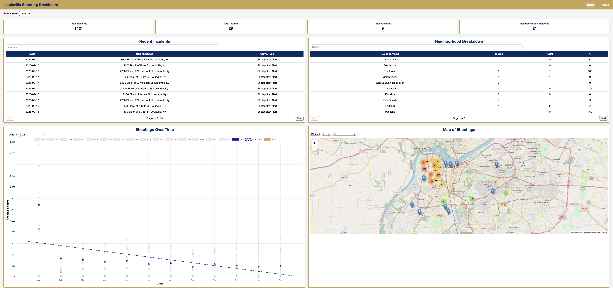

# Database Migration Project


A full-stack data project that ingests incident data, builds a local database via Python ETL, exposes an API through a Node.js backend, and visualizes insights in a Vue.js dashboard. The goal is to switch from a SQLite database to a MySql database. 



---

## Project Structure

| Folder            | Purpose                                                                         |
| ----------------- | ------------------------------------------------------------------------------- |
| `dataPortion/`    | Python ETL pipeline (`etlPipeline.py`) — fetches and builds the SQLite database |
| `Backend/`        | Node.js API server (`server.js`)                                                |
| `ReportShooting/` | Vue.js frontend dashboard                                                       |
| `MySQL`           | Docker container for the MySQL database                                         |

SQLite database location: `Backend/database/crime_data.db`

---

## Prerequisites

* **Node.js** (v18+) and **npm**
* **Python 3.9+** 
* **virtualenv**

---

## 1) Run the Python ETL Pipeline (Build the Database)

This generates/updates the SQLite database.

```bash
cd dataPortion
```

(recommended):

```bash
python3 -m venv venv
source venv/bin/activate   # Mac / Linux
# or on Windows
venv\Scripts\activate
```

Install dependencies:

```bash
pip install -r requirements.txt
```

Run the ETL script:

```bash
python etlPipeline.py
```

Output: `Backend/database/crime_data.db`

---

## 2) Start the Node.js Backend

```bash
cd Backend
npm install
```

Start the backend server:

```bash
node server.js
```

Default server URL:

```
http://localhost:3000
```

> The server reads the SQLite database `crime_data.db` and exposes API endpoints.

---

## 3) Start the Vue.js Dashboard

```bash
cd ReportShooting
npm install
npm run dev
```

Default frontend URL:

```
http://localhost:5173
```

The dashboard expects the backend API to be running at `http://localhost:3000`.
If your backend runs on a different host/port, update the environment variable:

```
VITE_API_URL=http://localhost:3000
```

---

## Typical Workflow

1️⃣ Run Python ETL to build/update the database.
2️⃣ Start Node backend to serve the API.
3️⃣ Start Vue frontend to view the dashboard.

---

## API Overview

The backend serves the following routes (examples):

* `GET /shootings?year=YYYY` — List shootings for a given year
* `GET /totalincidents` — Returns list of years / total incidents
* `GET /shootingtype` — Returns aggregated shooting types
* `GET /neighborhoods` — Returns neighborhoods impacted
* `GET /neighborhood-breakdown?year=YYYY` — Breakdown by neighborhood


---


## Notes

* Database: SQLite, stored at `Backend/database/crime_data.db`
* Frontend expects the backend API running at `http://localhost:3000`
* Recommended workflow: ETL → Backend → Frontend

---

### Virtual Environment Commands
| Command | Linux/Mac | GitBash |
| ------- | --------- | ------- |
| Create | `python3 -m venv venv` | `python -m venv venv` |
| Activate | `source venv/bin/activate` | `source venv/Scripts/activate` |
| Install | `pip install -r requirements.txt` | `pip install -r requirements.txt` |
| Deactivate | `deactivate` | `deactivate` |


## Docker Desktop 

- Download Docker Desktop from [Here.](https://www.docker.com/products/docker-desktop/)
- Install the application. 
- Launch the application 
  - It will run in the background and has to be open
- Navigate tot he MySQL folder 
- Follow the instructions in the readme file